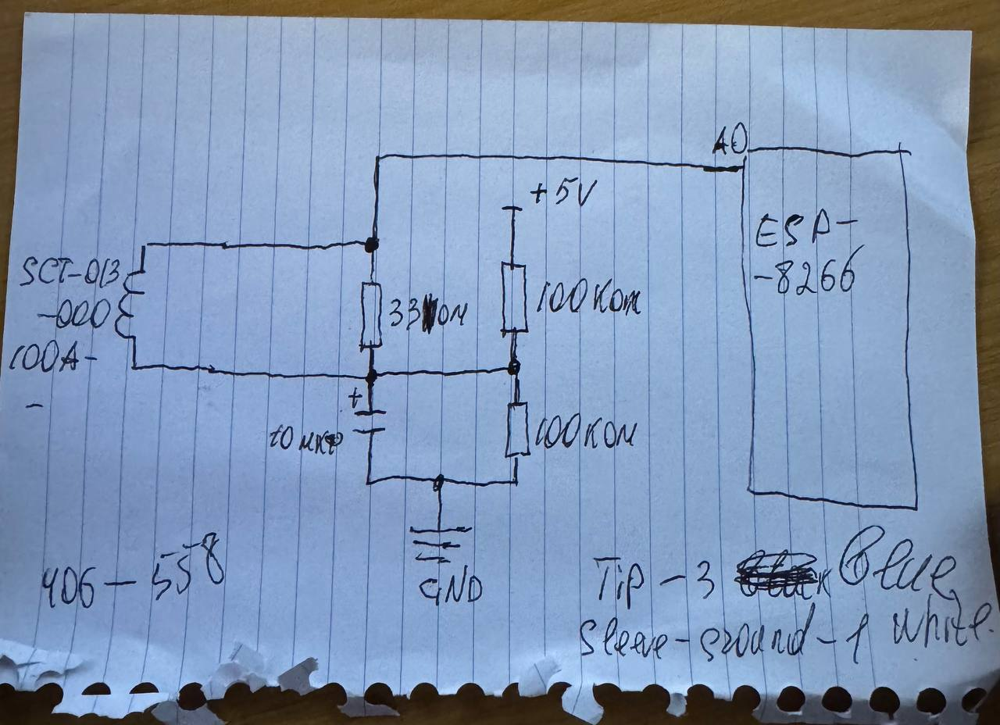

<h1>ESP8266 + SCT-013-000 Current Monitor</h1>

A simple current monitoring project using an ESP8266 NodeMCU and an SCT-013-000 (100A:50mA) current transformer. The project measures AC current consumption of a dryer machine and transfer data via MQTT to Home Assistant.

<h3>Features</h3>
<ul>
<li>Measure AC current using SCT-013-000</li>
<li>Calculate RMS current</li>
<li>Works with ESP8266 NodeMCU</li>
<li>Low-cost hardware</li>
<li>Suitable for Home Assistant integration</li>
<li>Detect appliance ON/OFF state</li>
<li>Monitor dryer machine operation</li>
</ul>

<h3>Hardware</h3>
<ul>
<li>ESP8266 NodeMCU</li>
<li>SCT-013-000 (100A:50mA) Current Transformer</li>
<li>33Ω burden resistor</li>
<li>2 × 100kΩ resistors</li>
<li>10µF electrolytic capacitor</li>
<li>3.5mm audio jack connector</li>
</ul>

<h3>Circuit Description</h3>

The SCT-013-000 is a current transformer that produces a small AC current proportional to the current flowing through the monitored wire. 
A burden resistor converts the CT output current into a measurable voltage. 
A voltage divider consisting of two 100kΩ resistors creates a DC bias at approximately half of the ESP8266 ADC reference voltage. This allows the AC waveform to be shifted into the ADC input range. 
The capacitor stabilizes the bias voltage and reduces noise.

<h3>Important Notes</h3>

Clamp Around One Conductor Only

<h3>Current Calculation</h3>

The RMS current is calculated from ADC samples:

<ul>
<li>Read multiple ADC samples.</li>
<li>Remove DC offset.</li>
<li>Convert ADC counts to voltage.</li>
<li>Convert voltage to CT secondary current.</li>
<li>Apply CT ratio.</li>
<li>Calculate RMS current.</li>  
</ul>
